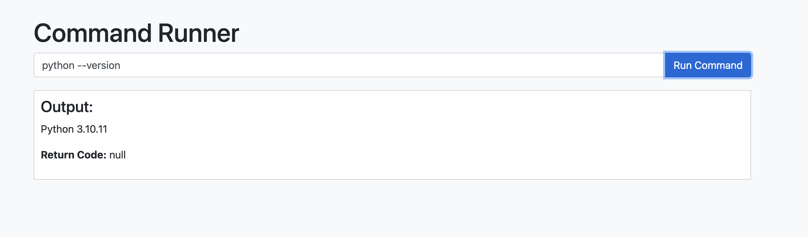
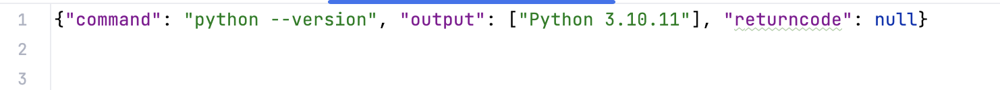

# Command Runner API

The Command Runner API is a simple Flask-based API that allows you to send command-line commands from a frontend and retrieve the command's output, error messages, and return code. This README provides instructions on how to set up, install dependencies, and use the API.


## Test Output

## JSON Output



## Table of Contents

- [Installation](#installation)
- [Requirements](#requirements)
- [Usage](#usage)
- [Security Considerations](#security-considerations)

## Installation

1. Move to Project Directory:

   ```bash
   cd CLI_API
   ```

2. Create a virtual environment (recommended) to isolate the project's dependencies:

   ```bash
   python -m venv venv
   ```

3. Activate the virtual environment:

   - On Windows:

     ```bash
     venv\Scripts\activate
     ```

   - On macOS and Linux:

     ```bash
     source venv/bin/activate
     ```

4. Install the required packages using pip:

   ```bash
   pip install -r requirements.txt
   ```

5. Run the Flask development server:

   ```bash
   python app.py
   ```

   The server will start on `http://127.0.0.1:5000`.

## Requirements

- Python 3.6+
- Flask 2.0.0
- flask-cors 3.1.1

## Usage

1. Open the `test.html` file in a web browser to access the frontend interface.

2. Enter a command in the input textbox and click the "Run Command" button.

3. The output, error messages, and return code of the command will be displayed on the webpage.

## Security Considerations

- **Input Validation**: Ensure that any user-provided input is properly validated and sanitized to prevent potential security vulnerabilities.
- **CORS**: The API is configured with CORS to allow requests from any origin during development. In production, consider restricting allowed origins to enhance security.
- **Command Execution**: Be cautious when executing system commands provided by users. Sanitize and validate inputs to prevent command injection attacks.
